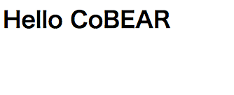

昨日今日と、オープンソースカンファレンスの合間に CoBEAR の開発をはじめました。

そしてついに、ブラウザで Hello, World の表示に成功しました。

これは、小さな一歩に見えますが、実はそこそこ大変でした。

というのも、BEAR.Sunday にはまだしっかりとしたマニュアルが整備されていません。そのため、開発は手探りになる部分があります。

それから、BEAR.Sunday はミニマルなフレームワークなので、デフォルトではブラウザで HTML を表示するだけの機能も備えていません。その機能は開発者が追加します。

ブラウザでHTMLを表示するには、

* テンプレートエンジンの Twig モジュールをインストールする（幸い、Twig モジュールは用意されています。ちょっとコードを書けば、Smarty でも phptal でも利用できます）
* Index ページリソースを修正する。今回は、BEAR.Sunday となっている部分を CoBEAR に書き換えるだけです。
* var/www/index.php の $context に 'html-' を追加する。
* HttpResponderModule を追加して、ブラウザからのアクセスの場合は text/html ヘッダを返すようにする。デフォルトでは、application/json が返ります。

といった作業が必要になります。特に後ろの2つはマニュアルに書かれていないので、ソースコードを読みながら対応しました。

このように、やや大変では有りますが、BEAR.Sunday の基本について多くのことを学べました。
